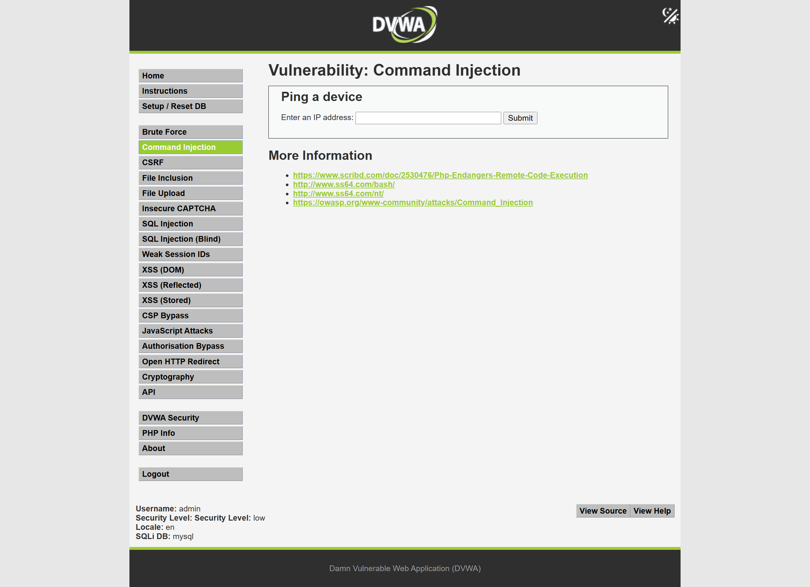
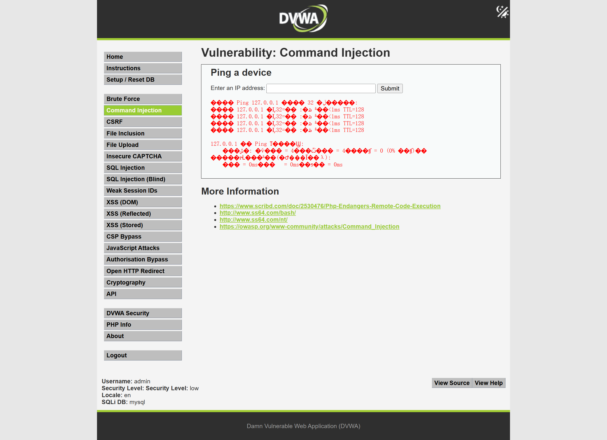
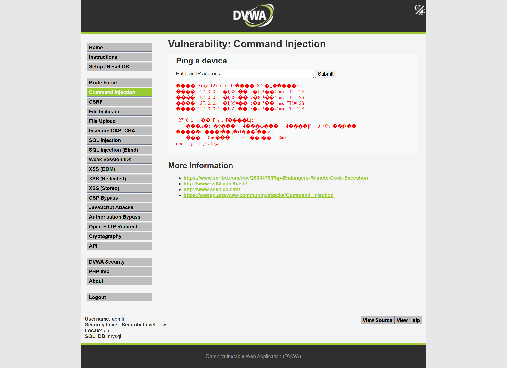
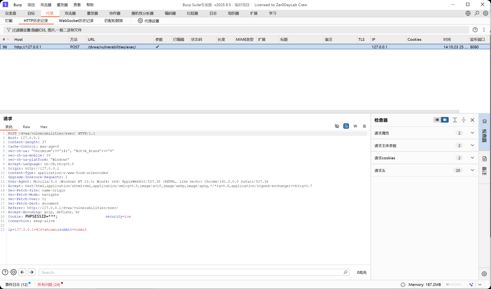
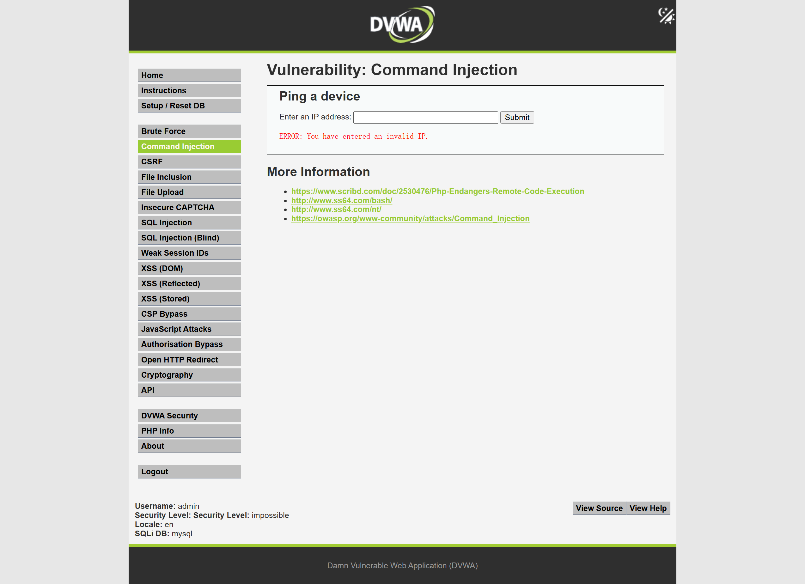

# Web 漏洞复现报告：命令执行漏洞

## 1. 漏洞概述

* 漏洞名称：命令执行漏洞

* 漏洞类型：系统命令注入 / 输入校验缺陷

* 风险等级：高

* 复现环境：DVWA

* 测试方式：本地授权靶场测试

* 影响范围：网络诊断、主机检测、文件处理、备份压缩、图片处理等调用系统命令的功能点。

本次测试在本地 DVWA 靶场中完成，安全等级设置为 Low。通过 Command Injection 模块测试发现，服务端将用户输入直接拼接到系统命令中执行，导致用户可以通过命令连接符执行额外系统命令。

本次测试仅使用 `whoami` 进行无害验证，用于证明额外命令被执行，不涉及删除文件、写入后门、反弹连接或真实目标测试。

## 2. 漏洞原理

命令执行漏洞的核心问题是：服务端把用户输入直接拼接到了系统命令里。

通俗理解：

```text

网站本来只想让服务器帮用户 ping 一个 IP。

但是网站没有检查用户输入是不是合法 IP。

用户输入了“IP + 命令连接符 + 额外命令”。

服务器执行时，就不只执行 ping，还执行了后面的额外命令。

```

正常情况下，用户输入：

```text

127.0.0.1

```

服务端可能执行：

```text

ping 127.0.0.1

```

但如果用户输入：

```text

127.0.0.1 & whoami

```

服务端拼接后可能变成：

```text

ping 127.0.0.1 & whoami

```

其中 `&` 在 Windows 命令中可以表示继续执行后面的命令。因此服务器会先执行 `ping 127.0.0.1`，再执行 `whoami`。

如果在真实业务系统中存在类似问题，攻击者可能进一步执行更多系统命令，造成服务器信息泄露、文件操作、权限扩大等风险。

## 3. 复现环境

* 系统环境：Windows

* Web 环境：小皮面板 / PHP / MySQL

* 靶场名称：DVWA

* 靶场地址：`http://127.0.0.1/dvwa`

* 使用工具：Chrome、Burp Suite

* 测试账号：本地靶场测试账号

* 漏洞模块：Command Injection

* 安全等级：Low / Impossible

## 4. 复现步骤

### 4.1 定位测试点

进入 DVWA 后，将安全等级设置为 Low，选择左侧菜单中的：

```text

Command Injection

```

该页面提供一个 IP 输入框，功能说明为 `Ping a device`，用户输入 IP 后，服务器会执行 ping 命令并返回结果。

截图：



该功能属于典型命令执行测试点，因为它会调用系统命令处理用户输入。

### 4.2 正常 ping 测试

在输入框中输入：

```text

127.0.0.1

```

提交后，页面返回 ping 执行结果。

截图：



该步骤说明该功能的正常逻辑是：服务端接收用户输入的 IP 地址，并调用系统 ping 命令进行检测。

页面中的部分中文显示存在乱码，这是 Windows 命令输出编码问题，不影响漏洞验证。

### 4.3 构造命令执行测试输入

在输入框中输入：

```text

127.0.0.1 & whoami

```

提交后，页面除了返回 ping 结果外，还返回了当前系统用户信息：

```text

desktop-mtlpfah\\wu

```

截图：



该结果说明 `whoami` 命令被服务端执行，用户输入已经影响了后端系统命令执行逻辑，命令执行漏洞成功复现。

### 4.4 Burp Suite 抓包分析

使用 Burp Suite 抓取命令执行测试请求。

截图：



请求中的关键内容为：

```http

POST /dvwa/vulnerabilities/exec/ HTTP/1.1

Cookie: PHPSESSID=***; security=low


ip=127.0.0.1+%26+whoami&Submit=Submit

```

其中：

```text

%26

```

是 URL 编码后的：

```text

&

```

所以请求参数实际代表：

```text

127.0.0.1 & whoami

```

该请求说明用户通过 `ip` 参数提交了命令连接符和额外命令，服务端在 Low 模式下未进行有效拦截，导致命令被执行。

### 4.5 Impossible 模式对比

将 DVWA 安全等级切换为 Impossible，再次提交：

```text

127.0.0.1 & whoami

```

页面返回：

```text

ERROR: You have entered an invalid IP.

```

截图：



该结果说明 Impossible 模式下服务端对输入进行了更严格的校验，只允许合法 IP 地址，原来的命令拼接方式无法继续生效。

## 5. 漏洞验证结果

命令执行漏洞成功复现。

验证依据如下：

1. 正常输入 `127.0.0.1` 时，页面返回 ping 结果；

2. 输入 `127.0.0.1 & whoami` 后，页面额外返回当前系统用户信息；

3. Burp Suite 抓包显示 `ip` 参数中包含命令连接符 `%26` 和 `whoami`；

4. 在 Impossible 模式下，同样输入被识别为非法 IP，未继续执行额外命令；

5. 说明该漏洞可以通过严格输入校验和安全命令调用方式进行修复。

关键截图：

| 截图                                                              | 说明                  |
| --------------------------------------------------------------- | ------------------- |
| [01-command-page](../screenshots/command-injection/01-command-page.png)             | 命令执行测试页面            |
| [02-normal-ping](../screenshots/command-injection/02-normal-ping.png)              | 正常 ping 测试结果        |
| [03-command-injection-result](../screenshots/command-injection/03-command-injection-result.png) | 命令执行漏洞触发结果          |
| [04-burp-command-request](../screenshots/command-injection/04-burp-command-request.png)     | Burp 抓取命令执行请求       |
| [05-impossible-compare](../screenshots/command-injection/05-impossible-compare.png)       | Impossible 模式下输入被拦截 |

## 6. 风险影响

命令执行漏洞可能造成以下影响：

* 执行非预期系统命令；

* 获取服务器当前运行用户信息；

* 读取系统环境信息；

* 枚举目录、文件、进程和网络信息；

* 修改或删除服务器文件；

* 在权限配置不当时，可能进一步扩大影响范围；

* 与其他漏洞组合利用时，可能导致服务器被控制。

在真实业务系统中，如果网络诊断、文件处理、备份压缩、图片处理等功能直接拼接用户输入并调用系统命令，攻击者可能通过命令连接符执行额外命令，造成严重安全风险。

本次测试只使用 `whoami` 进行无害验证，不涉及破坏性命令或真实目标测试。

## 7. 修复建议

建议从以下方面修复命令执行漏洞：

1. 尽量避免直接调用系统 Shell 命令；

2. 优先使用语言内置安全 API 实现业务功能，例如使用网络库替代系统 ping 命令；

3. 对用户输入进行严格白名单校验，例如 IP 参数只允许合法 IPv4 或 IPv6 格式；

4. 禁止用户输入命令连接符，例如 `&`、`&&`、`|`、`;` 等；

5. 如果必须调用系统命令，应使用参数数组方式传参，避免拼接字符串命令；

6. Web 服务进程应使用低权限账号运行，避免高权限执行系统命令；

7. 关闭详细错误回显，避免暴露系统路径和命令执行细节；

8. 对异常输入和命令执行失败行为记录安全日志并配置告警；

9. 前端校验只能作为辅助，不能替代服务端校验。

## 8. 复测结论

* 复测结果：通过

* 复测说明：在 DVWA Impossible 安全等级下，输入 `127.0.0.1 & whoami` 后，系统提示 IP 非法，未执行额外系统命令。

* 整改建议：真实业务系统应避免拼接系统命令，采用安全 API、输入白名单、低权限运行和日志监控等方式降低命令执行风险。
