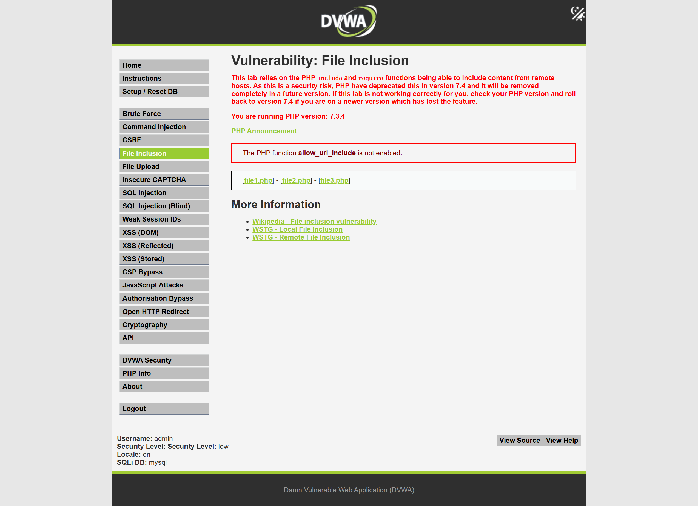
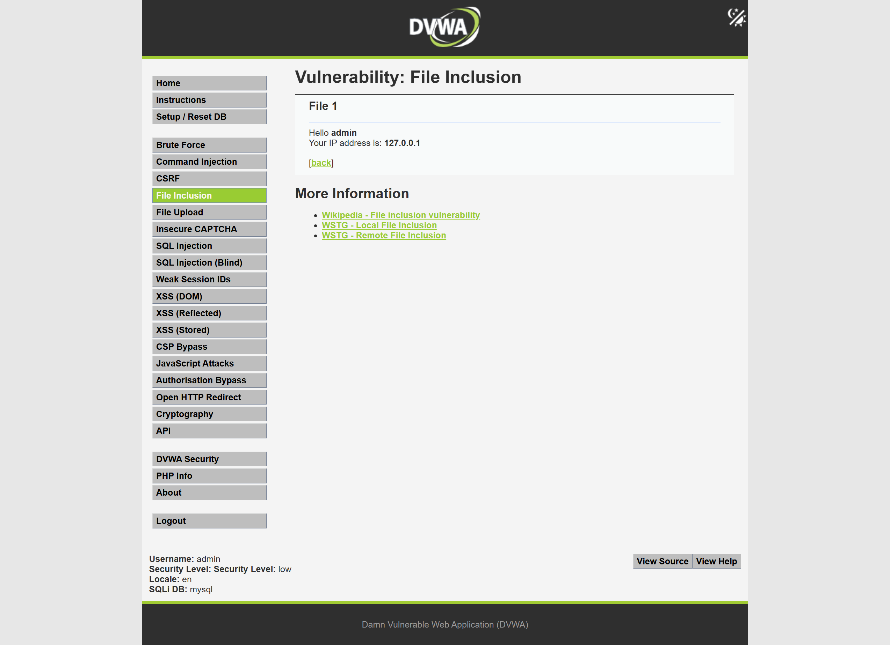
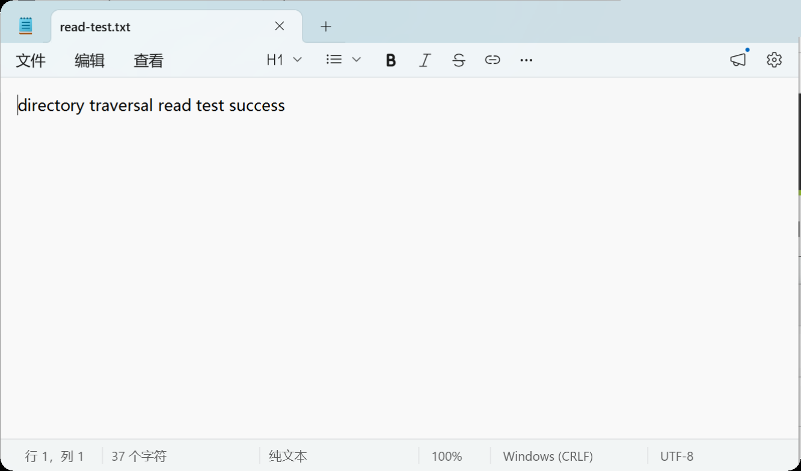
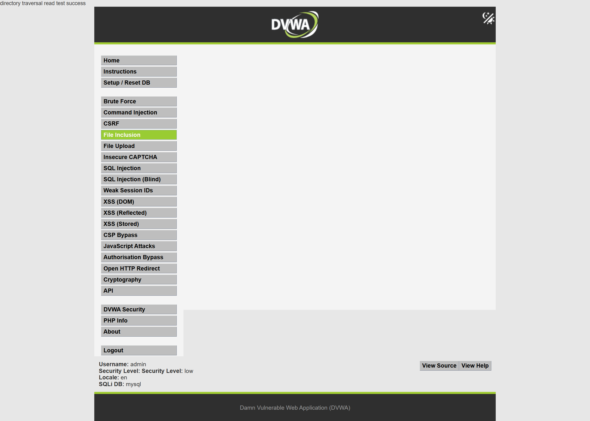
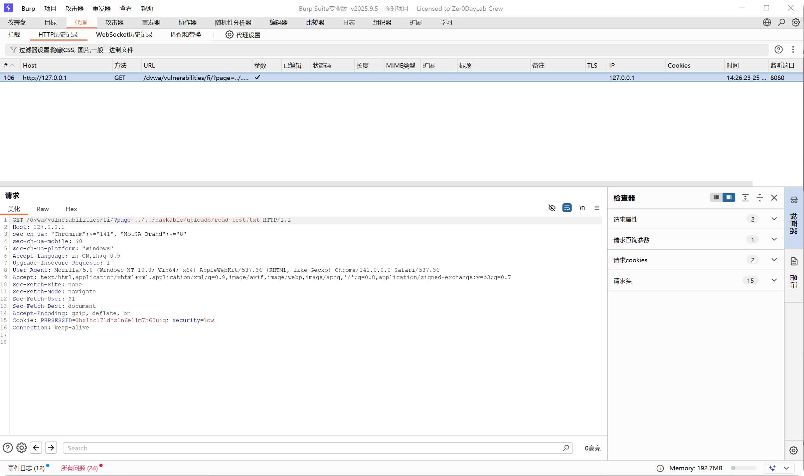

# Web 漏洞复现报告：目录遍历 / 任意文件读取

## 1. 漏洞概述

* 漏洞名称：目录遍历 / 任意文件读取

* 漏洞类型：路径校验缺陷 / 文件包含漏洞

* 风险等级：高

* 复现环境：DVWA

* 测试方式：本地授权靶场测试

* 影响范围：文件预览、文件下载、日志查看、模板加载、语言包加载、帮助文档读取等根据用户输入读取文件的功能点。

本次测试在本地 DVWA 靶场中完成，安全等级设置为 Low。通过 File Inclusion 模块测试发现，服务端根据用户传入的 `page` 参数加载文件，但没有限制文件路径范围，导致用户可以通过 `../` 跳转到上级目录，读取非预期路径下的文件。

本次测试仅读取自己创建的无害测试文件 `read-test.txt`，不读取真实敏感文件，不涉及未授权目标测试。

## 2. 漏洞原理

目录遍历漏洞的核心问题是：服务端根据用户传入的文件路径读取文件，但没有限制用户只能读取指定目录下的文件。

通俗理解：

```text

网站本来只想让用户读取指定的几个文件。

但它把文件路径交给用户控制。

用户就可以使用 ../ 往上跳目录，

最后读取原本不应该被访问的文件。

```

其中：

```text

../

```

表示返回上一级目录。

例如：

```text

../../hackable/uploads/read-test.txt

```

可以理解为：

```text

从当前目录往上跳两级，再进入 hackable/uploads 目录，读取 read-test.txt 文件。

```

如果服务端没有对路径进行限制，就可能读取到非预期文件。

## 3. 复现环境

* 系统环境：Windows

* Web 环境：小皮面板 / PHP / MySQL

* 靶场名称：DVWA

* 靶场地址：`http://127.0.0.1/dvwa`

* 使用工具：Chrome、Burp Suite、记事本

* 测试账号：本地靶场测试账号

* 漏洞模块：File Inclusion

* 安全等级：Low / Impossible

## 4. 复现步骤

### 4.1 定位测试点

进入 DVWA 后，将安全等级设置为 Low，选择左侧菜单中的：

```text

File Inclusion

```

页面中提供了 `file1.php`、`file2.php`、`file3.php` 等链接，点击后页面会根据 `page` 参数加载对应文件。

截图：



该功能属于典型文件读取 / 文件包含测试点，因为用户可以通过请求参数影响服务端加载的文件。

### 4.2 正常文件加载测试

点击页面中的：

```text

file1.php

```

页面正常加载 File 1 内容。

截图：



该步骤说明该功能的正常逻辑是：服务端根据用户传入的 `page=file1.php` 加载指定文件。

### 4.3 创建无害测试文件

为了避免读取真实敏感文件，在 DVWA 的上传目录中创建一个无害测试文件：

```text

read-test.txt

```

文件内容为：

```text

directory traversal read test success

```

截图：



该文件仅用于证明目录遍历读取是否成功，不包含任何敏感信息。

### 4.4 构造目录遍历读取路径

在浏览器中访问：

```text

http://127.0.0.1/dvwa/vulnerabilities/fi/?page=../../hackable/uploads/read-test.txt

```

页面成功显示：

```text

directory traversal read test success

```

截图：



该结果说明 `page` 参数可以通过 `../../` 跳出原有文件目录，读取 `hackable/uploads` 目录下的测试文件，目录遍历 / 任意文件读取漏洞成功复现。

### 4.5 Burp Suite 抓包分析

使用 Burp Suite 抓取目录遍历读取请求。

截图：



请求中的关键内容为：

```http

GET /dvwa/vulnerabilities/fi/?page=../../hackable/uploads/read-test.txt HTTP/1.1

Cookie: PHPSESSID=***; security=low

```

该请求说明用户通过 `page` 参数控制了服务端读取的文件路径。

### 4.6 Impossible 模式对比

将 DVWA 安全等级切换为 Impossible，再次访问：

```text

http://127.0.0.1/dvwa/vulnerabilities/fi/?page=../../hackable/uploads/read-test.txt

```

在 Impossible 模式下，页面不再显示测试文件内容，说明服务端已经限制了可加载文件范围。

截图：


## 5. 漏洞验证结果

目录遍历 / 任意文件读取漏洞成功复现。

验证依据如下：

1. 正常情况下，`page=file1.php` 可以加载指定文件；

2. 创建无害测试文件 `read-test.txt`；

3. 通过 `page=../../hackable/uploads/read-test.txt` 成功读取测试文件内容；

4. Burp Suite 抓包显示文件路径由 `page` 参数控制；

5. 在 Impossible 模式下，同样路径不再返回测试文件内容。

关键截图：

| 截图                                                                  | 说明                  |
| ------------------------------------------------------------------- | ------------------- |
| [01-file-inclusion-page](../screenshots/directory-traversal/01-file-inclusion-page.png)        | File Inclusion 测试页面 |
| [02-normal-file-include](../screenshots/directory-traversal/02-normal-file-include.png)        | 正常加载 file1.php      |
| [03-proof-file-content](../screenshots/directory-traversal/03-proof-file-content.png)         | 无害测试文件内容            |
| [04-directory-traversal-result](../screenshots/directory-traversal/04-directory-traversal-result.png) | 目录遍历读取测试文件成功        |
| [05-burp-traversal-request](../screenshots/directory-traversal/05-burp-traversal-request.png)     | Burp 抓取目录遍历请求       |
| [06-impossible-compare](../screenshots/directory-traversal/06-impossible-compare.png)         | Impossible 模式安全对比   |

## 6. 风险影响

目录遍历 / 任意文件读取漏洞可能造成以下影响：

* 读取服务器上的非预期文件；

* 泄露配置文件、日志文件、源码文件；

* 获取数据库连接信息、密钥、Token 等敏感信息；

* 辅助攻击者了解系统目录结构；

* 与文件上传、命令执行等漏洞组合利用时扩大攻击影响。

在真实业务系统中，如果文件下载、日志查看、模板加载等功能存在目录遍历漏洞，攻击者可能通过构造路径读取敏感文件，造成信息泄露。

本次测试仅读取自己创建的无害测试文件，不涉及真实敏感文件读取。

## 7. 修复建议

建议从以下方面修复目录遍历 / 任意文件读取漏洞：

1. 不直接使用用户传入的文件路径；

2. 使用文件 ID 与服务端文件路径进行映射，例如 `id=1` 对应固定文件；

3. 对可读取文件设置白名单，只允许访问明确允许的文件；

4. 对路径进行规范化处理，识别并拦截 `../` 等目录跳转字符；

5. 限制文件读取目录，避免跳出指定根目录；

6. 设置最小权限，Web 服务账号不应拥有读取敏感系统文件的权限；

7. 避免在错误信息中暴露真实服务器路径；

8. 对异常路径访问行为记录日志并配置告警。

## 8. 复测结论

* 复测结果：通过

* 复测说明：在 DVWA Impossible 安全等级下，访问 `../../hackable/uploads/read-test.txt` 后不再返回测试文件内容，说明服务端对可加载文件范围进行了限制。

* 整改建议：真实业务系统应采用文件白名单、路径规范化、文件 ID 映射和最小权限原则，避免目录遍历和任意文件读取风险。
