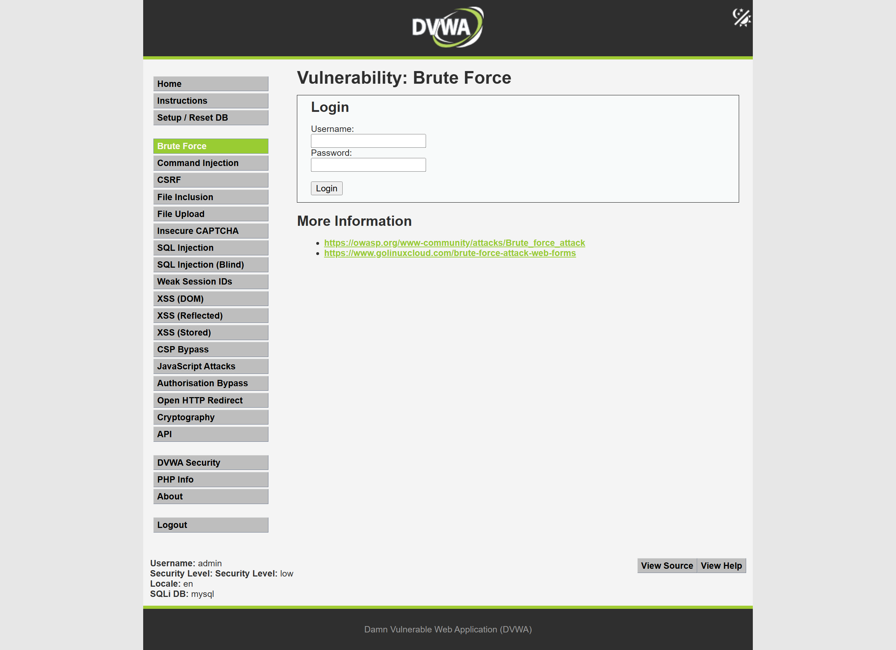
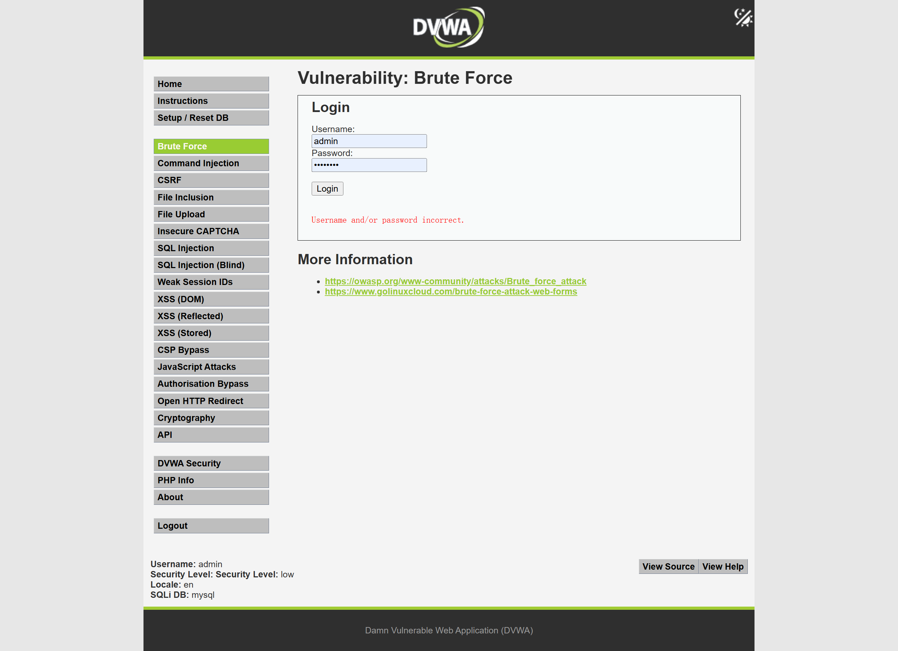
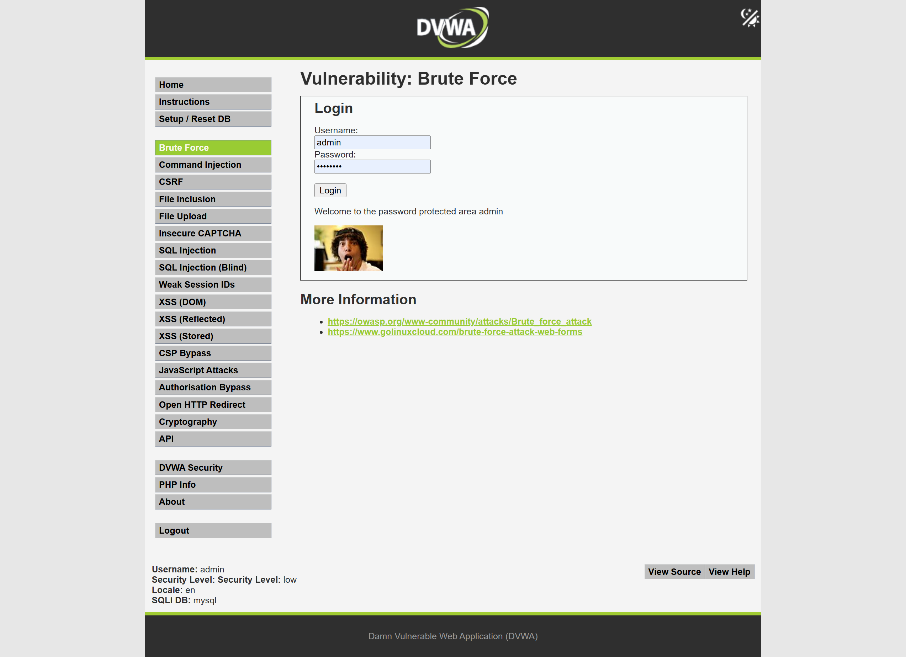
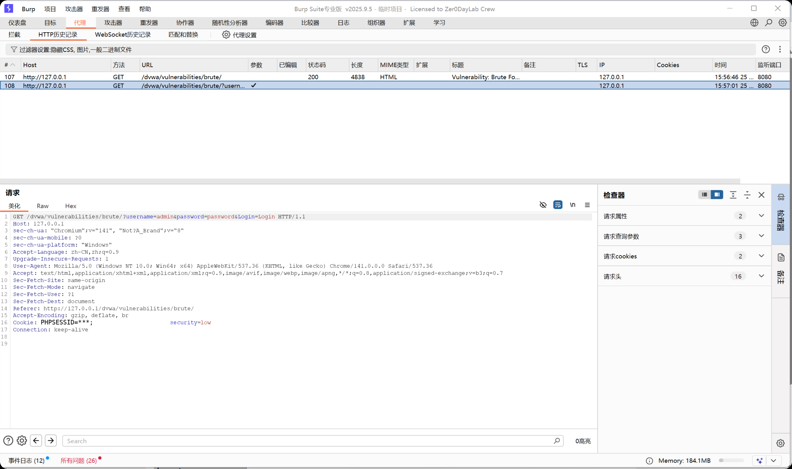
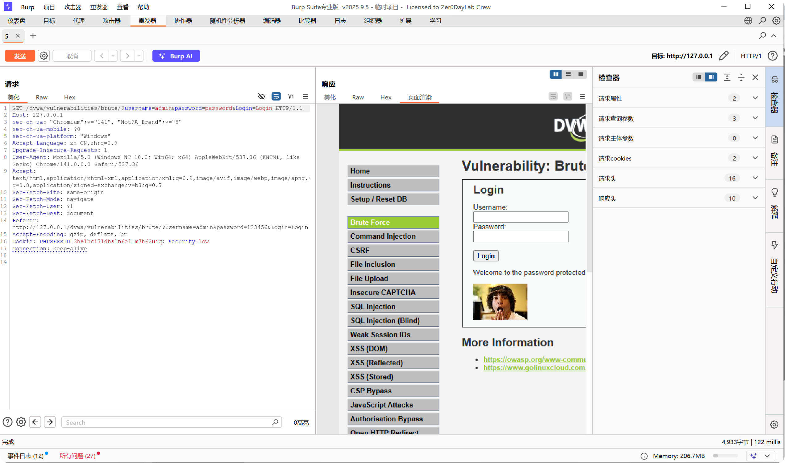
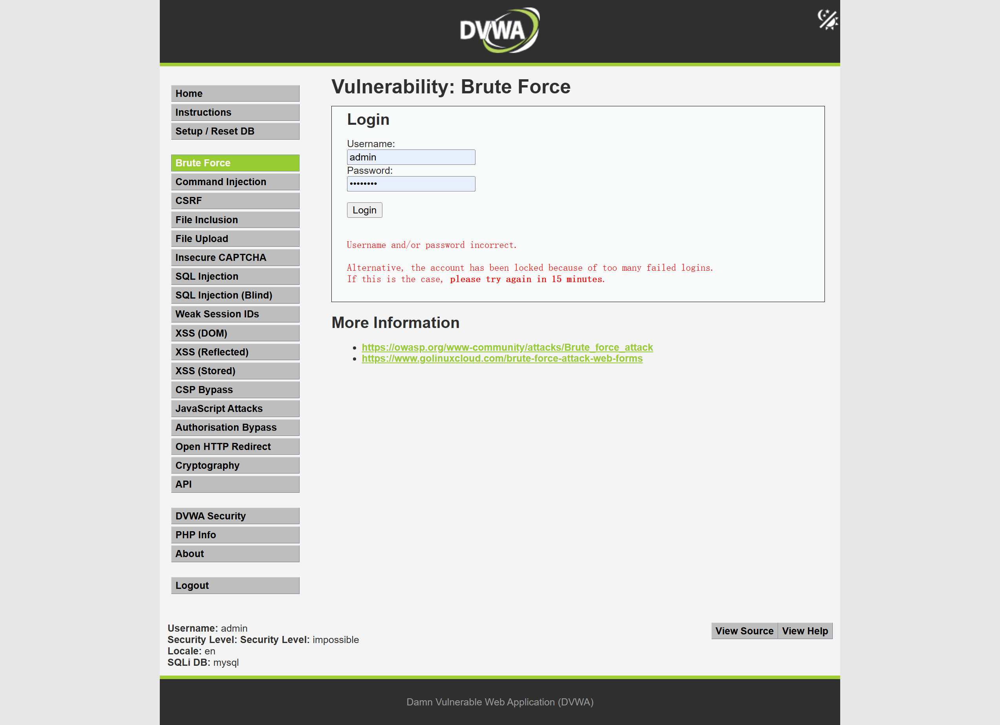

# Web 漏洞复现报告：弱口令 / 暴力破解

## 1. 漏洞概述

* 漏洞名称：弱口令 / 暴力破解

* 漏洞类型：身份认证缺陷 / 登录防护不足

* 风险等级：中危

* 复现环境：DVWA

* 测试方式：本地授权靶场测试

* 影响范围：登录接口、后台管理入口、用户认证接口、运维管理平台等需要账号密码认证的功能点。

本次测试在本地 DVWA 靶场中完成，安全等级设置为 Low。通过 Brute Force 模块测试发现，登录接口可以反复提交用户名和密码，且默认弱口令 `admin/password` 可以登录成功。

本次测试仅在本地靶场中进行少量手工验证，不进行大规模密码爆破、不使用真实系统账号、不测试公网目标。

## 2. 漏洞原理

弱口令和暴力破解的核心问题可以分成两部分：

```text

弱口令：账号密码太简单，容易被猜中。

暴力破解：系统没有限制登录失败次数，攻击者可以反复尝试密码。

```

通俗理解：

```text

如果一个系统存在 admin/password 这种简单账号密码，

并且登录失败后没有验证码、锁定、限速或告警，

攻击者就可以不断尝试常见密码，直到猜中。

```

在本案例中，DVWA 的 Brute Force 模块提供了用户名和密码输入框。Low 安全等级下，登录请求中可以直接看到 `username` 和 `password` 参数，并且请求可以被 Burp Suite 重放和修改。

这说明系统缺少有效的登录防护机制，例如失败次数限制、验证码、账号锁定、IP 限速等。

## 3. 复现环境

* 系统环境：Windows

* Web 环境：小皮面板 / PHP / MySQL

* 靶场名称：DVWA

* 靶场地址：`http://127.0.0.1/dvwa`

* 使用工具：Chrome、Burp Suite

* 测试账号：本地靶场测试账号

* 漏洞模块：Brute Force

* 安全等级：Low / Impossible

## 4. 复现步骤

### 4.1 定位测试点

进入 DVWA 后，将安全等级设置为 Low，选择左侧菜单中的：

```text

Brute Force

```

该页面提供用户名和密码输入框，用于模拟登录认证场景。

截图：



该功能属于典型登录认证测试点，需要关注以下内容：

* 是否存在默认账号或弱口令；

* 登录失败后是否有次数限制；

* 是否存在验证码；

* 是否存在账号锁定机制；

* 是否存在 IP 限速；

* 是否记录异常登录日志。

### 4.2 错误密码测试

输入以下账号密码：

```text

Username: admin

Password: 123456

```

提交后，页面提示用户名或密码错误。

截图：



该步骤说明系统可以识别错误密码，但在 Low 模式下没有出现验证码、锁定或明显的登录频率限制。

### 4.3 正确弱口令测试

输入以下账号密码：

```text

Username: admin

Password: password

```

提交后，页面返回登录成功提示：

```text

Welcome to the password protected area admin

```

截图：



该结果说明本地靶场存在默认弱口令 `admin/password`，可以登录成功。

在真实系统中，如果存在类似默认账号或弱口令，并且没有登录防护机制，攻击者可能通过尝试常见密码接管账号。

### 4.4 Burp Suite 抓包分析

使用 Burp Suite 抓取登录请求。

截图：



请求中的关键内容为：

```http

GET /dvwa/vulnerabilities/brute/?username=admin&password=password&Login=Login HTTP/1.1

Cookie: PHPSESSID=***; security=low

```

该请求说明用户名和密码通过请求参数提交到服务端。Low 模式下，登录请求结构简单，缺少额外的动态校验参数。

### 4.5 Repeater 手工重放测试

将登录请求发送到 Burp Suite Repeater，手工修改 `password` 参数进行测试。

例如将密码改为：

```text

123456

```

请求返回登录失败。

再将密码改为：

```text

password

```

请求返回登录成功。

截图：



该步骤说明登录请求可以被手工重放，并通过修改 `password` 参数测试不同密码。Low 模式下没有明显的失败次数限制、验证码或请求频率限制。

本次测试仅进行少量手工验证，不进行大规模密码字典爆破。

### 4.6 Impossible 模式对比

将 DVWA 安全等级切换为 Impossible，再次尝试错误密码登录。

截图：



在 Impossible 模式下，页面出现更严格的失败提示，例如账号可能因多次失败登录被锁定，需要等待后再次尝试。这说明安全模式下增加了登录防护逻辑，不能像 Low 模式一样简单反复尝试密码。

## 5. 漏洞验证结果

弱口令 / 暴力破解风险成功验证。

验证依据如下：

1. Brute Force 页面存在用户名和密码输入框；

2. 输入错误密码时返回登录失败；

3. 输入 `admin/password` 时登录成功；

4. Burp Suite 抓包显示登录请求中包含 `username` 和 `password` 参数；

5. Repeater 可以重放请求并修改密码参数；

6. Low 模式下没有明显验证码、锁定、限速等保护；

7. Impossible 模式下出现更严格的失败限制提示。

关键截图：

| 截图                                                        | 说明                 |
| --------------------------------------------------------- | ------------------ |
| [01-brute-force-page](../screenshots/weak-password/01-brute-force-page.png)       | Brute Force 登录测试页面 |
| [02-wrong-password-result](../screenshots/weak-password/02-wrong-password-result.png)  | 错误密码登录失败           |
| [03-success-login-result](../screenshots/weak-password/03-success-login-result.png)   | 默认弱口令登录成功          |
| [04-burp-login-request](../screenshots/weak-password/04-burp-login-request.png)     | Burp 抓取登录请求        |
| [05-repeater-password-test](../screenshots/weak-password/05-repeater-password-test.png) | Repeater 手工重放测试    |
| [06-impossible-compare](../screenshots/weak-password/06-impossible-compare.png)     | Impossible 模式安全对比  |

## 6. 风险影响

弱口令 / 暴力破解可能造成以下影响：

* 普通用户账号被接管；

* 管理员后台被未授权访问；

* 用户隐私数据泄露；

* 攻击者冒用合法用户身份进行操作；

* 批量撞库或密码喷洒攻击；

* 与越权、文件上传等漏洞组合后扩大攻击影响。

在真实业务系统中，如果存在默认账号、简单密码，且登录接口没有失败次数限制，攻击者可能通过常见密码字典持续尝试，最终登录成功。

## 7. 修复建议

建议从以下方面修复弱口令和暴力破解风险：

1. 禁止使用默认密码，系统首次登录时强制修改默认密码；

2. 建立强密码策略，例如长度、复杂度、弱密码字典检测；

3. 对登录失败次数进行限制，例如连续失败 5 次后临时锁定账号；

4. 对同一 IP 的高频登录请求进行限速；

5. 对异常登录行为增加验证码或二次验证；

6. 对管理员账号启用多因素认证；

7. 记录登录日志，包括成功、失败、来源 IP、User-Agent、时间等信息；

8. 对异常登录行为配置告警，例如短时间内大量失败登录；

9. 不在错误提示中区分“用户名不存在”和“密码错误”，避免账号枚举；

10. 对长期未修改密码、弱密码账号进行定期巡检。

## 8. 复测结论

* 复测结果：通过

* 复测说明：在 DVWA Impossible 安全等级下，错误登录后出现更严格的失败限制提示，说明系统增加了防暴力破解机制。

* 整改建议：真实业务系统应结合强密码策略、失败次数限制、IP 限速、账号锁定、多因素认证和安全日志告警，降低弱口令和暴力破解风险。
