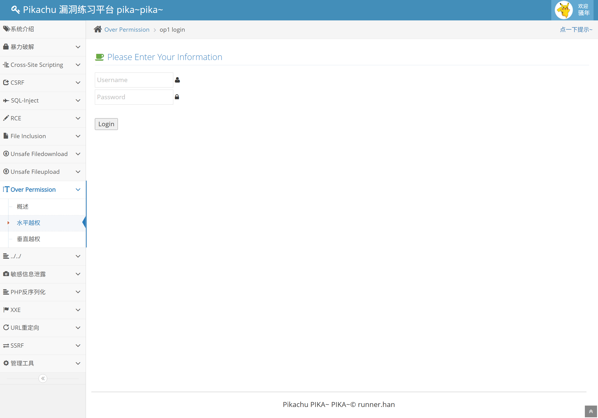
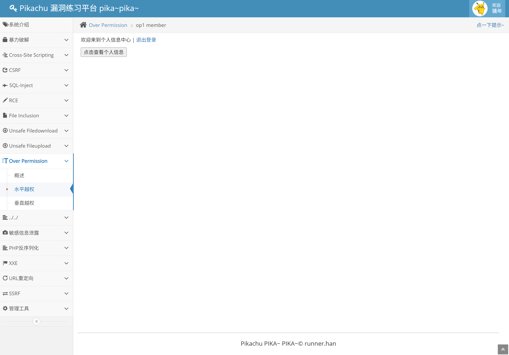
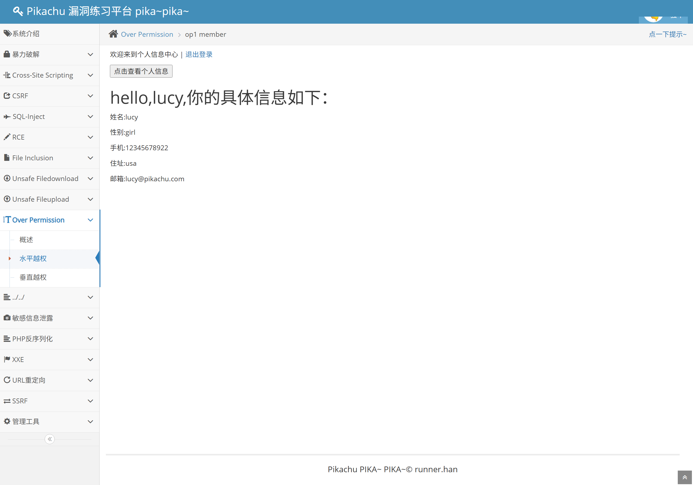
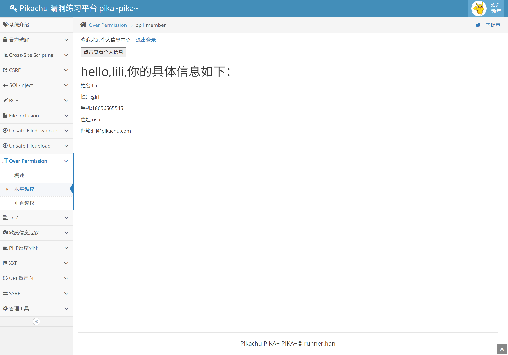
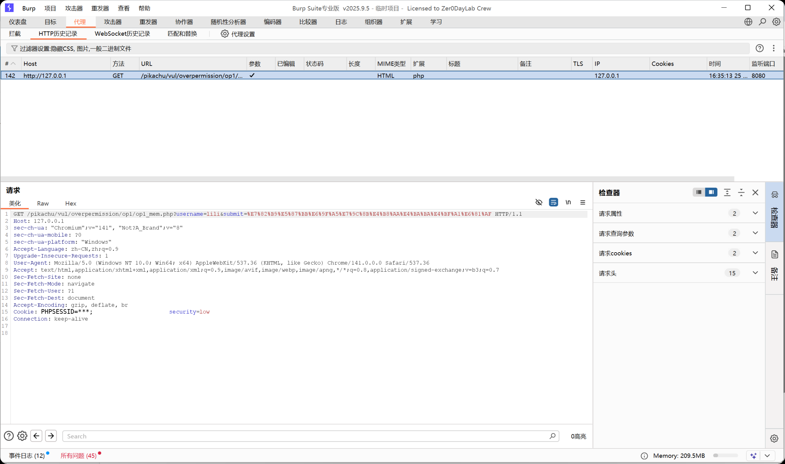

# Web 漏洞复现报告：水平越权漏洞

## 1. 漏洞概述

* 漏洞名称：水平越权漏洞

* 漏洞类型：访问控制缺陷 / 资源级权限校验缺失

* 风险等级：高

* 复现环境：Pikachu

* 测试方式：本地授权靶场测试

* 影响范围：用户资料、订单信息、收货地址、文件下载、工单详情、消息记录等与用户资源绑定的业务功能。

本次测试在本地 Pikachu 靶场中完成，主要复现 Over Permission 模块中的水平越权漏洞。测试发现，用户登录后可以通过修改请求参数中的 `username` 值，查看其他用户的个人信息。

本次测试仅在本地授权靶场中进行，不涉及真实业务系统和未授权目标测试。

## 2. 漏洞原理

水平越权是指同一权限级别的用户之间发生越权访问。

通俗理解：

```text

你登录的是 lucy，本来只能看 lucy 自己的信息。

但是你把请求里的 username=lucy 改成 username=lili。

系统没有检查你是不是 lili，就直接把 lili 的资料返回给你了。

```

该漏洞的核心不是“参数可以被修改”，而是服务端没有做资源级权限校验。

正常情况下，服务端在处理用户资料查询时，不应该只根据用户传入的参数查询数据，还应该判断：

```text

当前登录用户是谁？

当前登录用户是否有权限访问这个 username 对应的数据？

```

如果服务端只相信前端传来的 `username` 参数，就可能导致用户 A 访问用户 B 的信息。

## 3. 复现环境

* 系统环境：Windows

* Web 环境：小皮面板 / PHP / MySQL

* 靶场名称：Pikachu

* 靶场地址：`http://127.0.0.1/pikachu`

* 使用工具：Chrome、Burp Suite

* 漏洞模块：Over Permission / 水平越权

* 测试方式：本地授权靶场测试

## 4. 复现步骤

### 4.1 定位测试点

进入 Pikachu 后，选择左侧菜单：

```text

Over Permission -> 水平越权

```

截图：



该页面用于模拟用户登录后查看个人资料的业务场景。

### 4.2 使用普通用户登录

使用普通用户 `lucy` 登录水平越权模块。

截图：



登录后进入个人信息中心，当前用户身份为 `lucy`。

### 4.3 查看当前用户信息

点击查看个人信息后，页面返回 `lucy` 的资料，包括姓名、性别、手机号、地址和邮箱等信息。

截图：



该步骤说明正常情况下，当前登录用户可以查看自己的个人资料。

### 4.4 修改用户标识参数

观察浏览器地址栏，请求中存在用户标识参数：

```text

username=lucy

```

将该参数修改为另一个用户：

```text

username=lili

```

修改后的请求地址类似：

```text

http://127.0.0.1/pikachu/vul/overpermission/op1/op1_mem.php?username=lili&submit=点击查看个人信息

```

截图：


这一步说明用户可以直接修改请求中的资源标识参数。

### 4.5 访问其他用户信息

修改参数后，页面返回了 `lili` 的个人信息。

截图：



该结果说明当前登录用户 `lucy` 可以通过修改 `username` 参数查看 `lili` 的资料，水平越权漏洞成功复现。

### 4.6 Burp Suite 抓包分析

使用 Burp Suite 抓取越权访问请求。

截图：



请求中的关键内容为：

```http

GET /pikachu/vul/overpermission/op1/op1_mem.php?username=lili&submit=... HTTP/1.1

Cookie: PHPSESSID=***

```

该请求说明用户通过 `username` 参数控制了要查询的用户信息。服务端在返回数据前没有校验当前登录用户是否有权限访问 `lili` 的资料。

## 5. 漏洞验证结果

水平越权漏洞成功复现。

验证依据如下：

1. 当前登录用户为 `lucy`；

2. 正常情况下可以查看 `lucy` 的个人信息；

3. 修改 URL 中的 `username` 参数为 `lili`；

4. 页面返回了 `lili` 的个人信息；

5. Burp Suite 抓包显示越权访问通过 `username` 参数提交；

6. 服务端未基于当前登录用户身份进行资源级权限校验。

关键截图：

| 截图                                                           | 说明                   |
| ------------------------------------------------------------ | -------------------- |
| [01-over-permission-page](../screenshots/access-control/01-over-permission-page.png)     | 水平越权测试页面             |
| [02-horizontal-login-user-a](../screenshots/access-control/02-horizontal-login-user-a.png)  | 普通用户 lucy 登录         |
| [03-horizontal-user-a-info](../screenshots/access-control/03-horizontal-user-a-info.png)   | 查看 lucy 自己的信息        |
| [04-horizontal-change-userid](../screenshots/access-control/04-horizontal-change-userid.png) | 修改 username 参数为 lili |
| [05-horizontal-user-b-info](../screenshots/access-control/05-horizontal-user-b-info.png)   | 成功查看 lili 信息         |
| [06-burp-horizontal-request](../screenshots/access-control/06-burp-horizontal-request.png)  | Burp 抓取水平越权请求        |

## 6. 风险影响

水平越权漏洞可能造成以下影响：

* 用户个人资料泄露；

* 查看他人订单、地址、文件、工单等敏感数据；

* 修改或删除他人资源；

* 冒用其他用户身份进行业务操作；

* 造成隐私泄露、数据合规风险和业务风险。

在真实业务系统中，类似问题常见于以下参数：

```text

user_id

uid

username

order_id

address_id

file_id

ticket_id

message_id

```

如果服务端只根据这些参数查询数据，而不校验当前登录用户是否有权限访问对应资源，就可能产生水平越权。

## 7. 修复建议

建议从以下方面修复水平越权漏洞：

1. 服务端必须基于当前登录用户身份进行权限校验；

2. 查询用户资源时，不应完全信任前端传入的用户标识；

3. 当前用户查询自己的资料时，应优先从 Session 或 Token 中获取用户身份，而不是从请求参数中获取；

4. 对订单、文件、地址、工单等资源增加资源归属校验；

5. 对管理员查询他人数据的场景，应单独校验管理员权限；

6. 不要只依赖前端隐藏按钮或菜单，权限控制必须在服务端完成；

7. 对越权访问、异常 ID 枚举行为记录安全日志并进行告警；

8. 接口返回时避免暴露不必要的敏感字段。

## 8. 复测结论

* 复测结果：未复测

* 复测说明：当前 Pikachu 靶场用于漏洞演示，未对源码进行实际修复。本报告根据漏洞原理给出修复建议。

* 整改建议：真实业务系统应在服务端增加资源级权限校验，确保当前登录用户只能访问自己有权限的数据。
