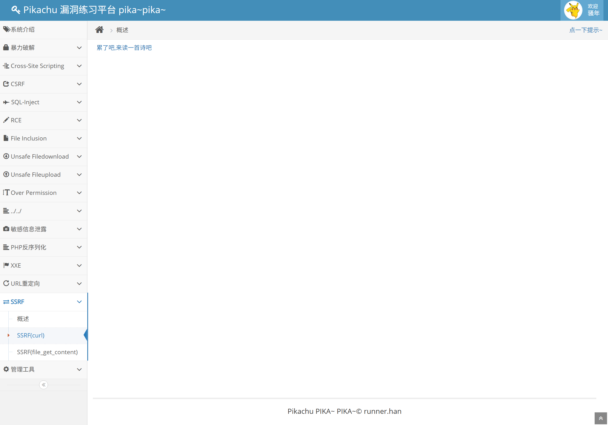
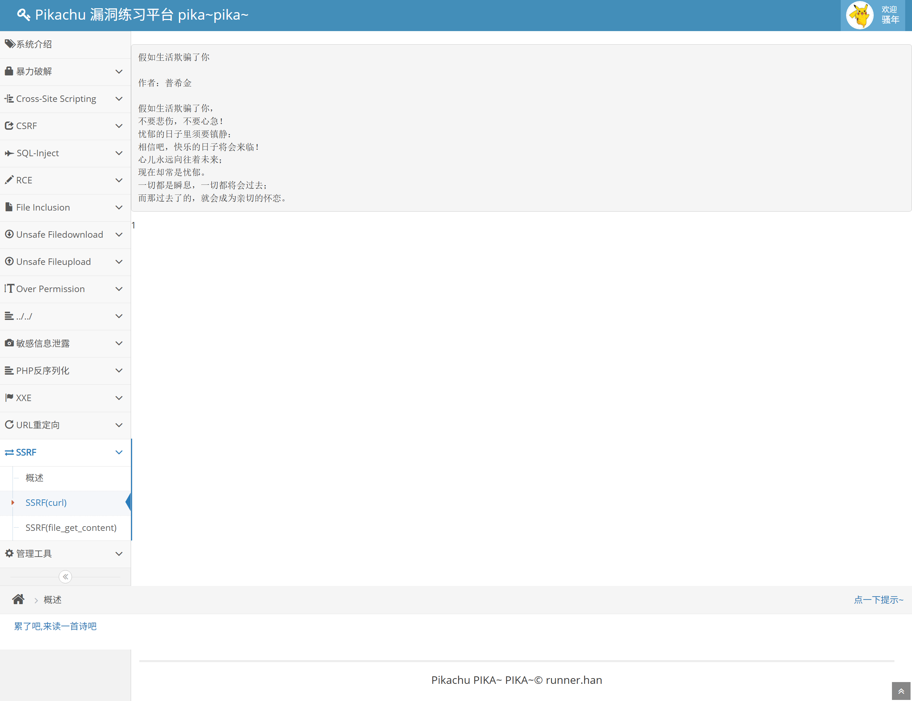
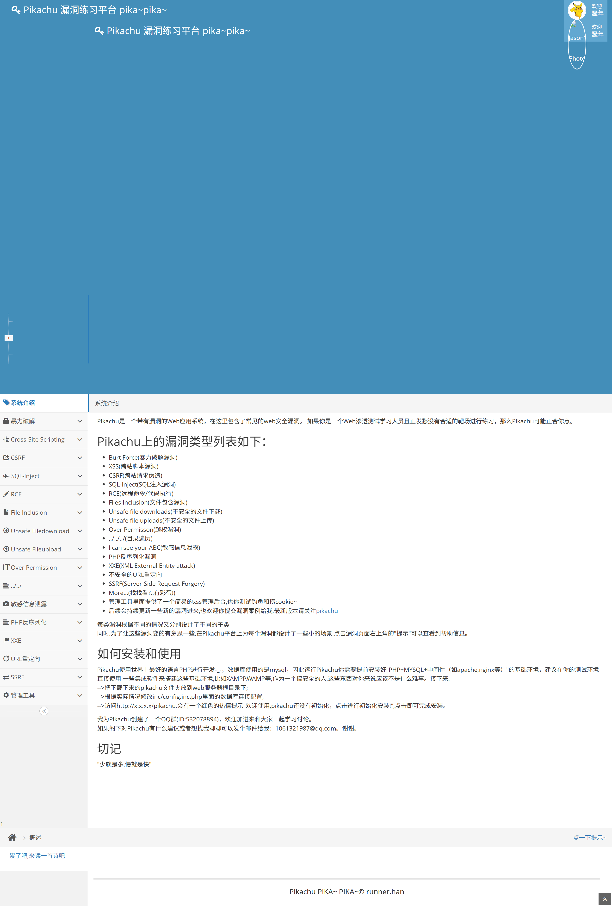
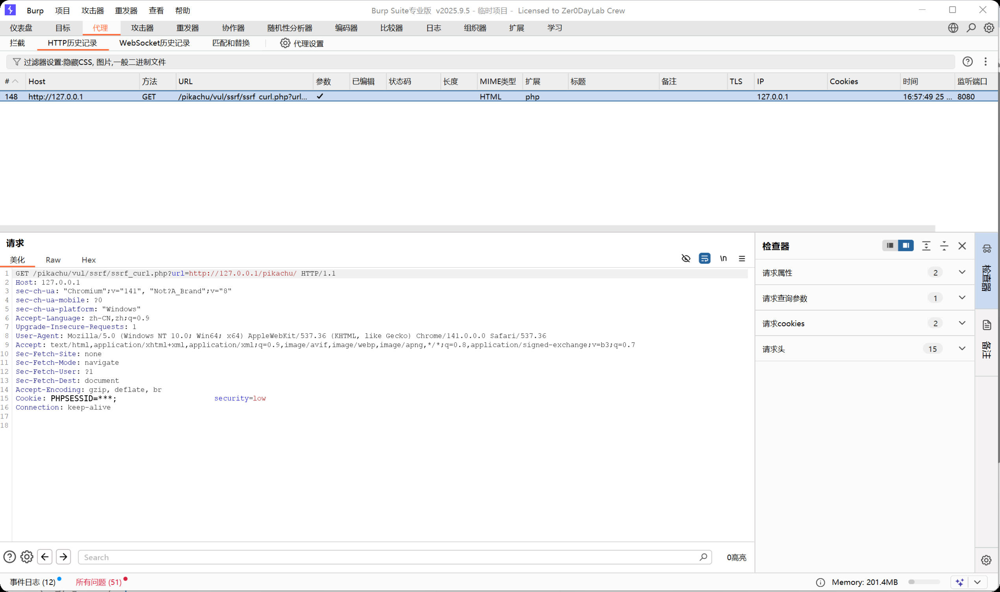

# Web 漏洞复现报告：SSRF 服务端请求伪造

## 1. 漏洞概述

* 漏洞名称：SSRF 服务端请求伪造
* 漏洞类型：服务端请求伪造 / URL 校验缺陷
* 风险等级：高
* 复现环境：Pikachu
* 测试方式：本地授权靶场测试
* 影响范围：URL 抓取、远程图片加载、网页预览、Webhook 测试、文件导入、接口回调、在线截图等由服务端请求外部资源的功能点。

本次测试在本地 Pikachu 靶场中完成，主要复现 SSRF(curl) 模块。测试发现，服务端会根据用户传入的 `url` 参数发起请求，但没有严格限制目标地址，导致用户可以让服务器请求本机地址 `http://127.0.0.1/pikachu/`，并将响应内容返回到页面中。

本次测试仅访问本地授权靶场地址，不访问公网真实目标、不访问云元数据地址、不进行内网扫描或端口探测。

## 2. 漏洞原理

SSRF 的全称是 Server-Side Request Forgery，中文通常称为服务端请求伪造。

通俗理解：用户自己不能直接访问某些内部资源，但服务器可能可以访问。如果网站允许用户控制服务器要请求的 URL，攻击者就可以让服务器替自己去访问这些地址。

正常功能逻辑如下：

1. 用户提交一个 URL；
2. 服务器去请求这个 URL；
3. 服务器把请求结果返回给用户。

如果服务端没有限制 URL 的协议、域名、IP 范围和重定向结果，攻击者就可能构造特殊 URL，让服务器访问本机服务、内网服务或其他敏感资源。

本案例中，Pikachu 的 SSRF(curl) 模块接收 `url` 参数，并使用服务端请求该地址。用户将 `url` 修改为 `http://127.0.0.1/pikachu/` 后，服务端请求该地址，并将 Pikachu 首页内容返回到了页面中，说明 SSRF 漏洞成功触发。

## 3. 复现环境

* 系统环境：Windows
* Web 环境：小皮面板 / PHP / MySQL
* 靶场名称：Pikachu
* 靶场地址：`http://127.0.0.1/pikachu`
* 使用工具：Chrome、Burp Suite
* 漏洞模块：SSRF(curl)
* 测试方式：本地授权靶场测试

## 4. 复现步骤

### 4.1 定位测试点

进入 Pikachu 后，选择左侧菜单：

`SSRF -> SSRF(curl)`

截图：

该页面提供一个由服务端请求远程资源的功能点，属于 SSRF 常见测试场景。

### 4.2 正常 URL 请求测试

点击页面中的默认链接后，页面返回了一段正常内容。

截图：

该步骤说明该功能的正常逻辑是：服务端根据用户提供的 URL 请求资源，并将响应内容返回给前端页面。

### 4.3 构造本机 URL 请求

将请求中的 `url` 参数修改为本地 Pikachu 地址：

`http://127.0.0.1/pikachu/`

完整请求示例：

`http://127.0.0.1/pikachu/vul/ssrf/ssrf_curl.php?url=http://127.0.0.1/pikachu/`

截图：

该步骤说明用户可以控制服务端要请求的目标地址。

### 4.4 观察 SSRF 返回结果

提交后，页面返回了 Pikachu 首页相关内容。

截图：

该结果说明服务端根据用户传入的 `url` 参数请求了 `http://127.0.0.1/pikachu/`，并将响应内容返回到了页面中。SSRF 漏洞成功复现。

在本地靶场环境中，`127.0.0.1` 指向当前本机服务。该测试用于证明服务端请求目标地址可被用户控制，不涉及真实内网探测。

### 4.5 Burp Suite 抓包分析

使用 Burp Suite 抓取 SSRF 请求。

截图：

请求中的关键内容为：

`GET /pikachu/vul/ssrf/ssrf_curl.php?url=http://127.0.0.1/pikachu/ HTTP/1.1`

请求中可以看到目标地址通过 `url` 参数提交给服务端。服务端未对该地址进行严格限制，导致可以请求本机地址。

## 5. 漏洞验证结果

SSRF 漏洞成功复现。

验证依据如下：

1. SSRF(curl) 页面存在由服务端请求 URL 的功能；
2. 默认链接可以返回正常内容；
3. 修改 `url` 参数为 `http://127.0.0.1/pikachu/` 后，页面返回了 Pikachu 首页内容；
4. Burp Suite 抓包显示目标地址由 `url` 参数控制；
5. 服务端未限制 `127.0.0.1` 等本机地址访问。

关键截图：

| 截图                                                 | 说明              |
| -------------------------------------------------- | --------------- |
| [01-ssrf-page](../screenshots/ssrf/01-ssrf-page.png)             | SSRF(curl) 测试页面 |
| [02-normal-url-request](../screenshots/ssrf/02-normal-url-request.png)    | 默认 URL 请求结果     |
| [03-localhost-url-input](../screenshots/ssrf/03-localhost-url-input.png)   | 修改 url 参数为本机地址  |
| [04-ssrf-localhost-result](../screenshots/ssrf/04-ssrf-localhost-result.png) | 返回 Pikachu 首页内容 |
| [05-burp-ssrf-request](../screenshots/ssrf/05-burp-ssrf-request.png)     | Burp 抓取 SSRF 请求 |

## 6. 风险影响

SSRF 漏洞可能造成以下影响：

* 访问服务器本机服务；
* 探测内网服务和端口；
* 请求只允许服务器访问的内部接口；
* 访问管理后台、监控面板、内部 API 等资源；
* 在云环境中可能访问云元数据服务；
* 与其他漏洞组合后扩大攻击影响。

在真实业务系统中，如果远程图片加载、URL 预览、Webhook 测试等功能存在 SSRF，攻击者可能利用服务器的网络位置访问内部资源，造成敏感信息泄露或进一步攻击风险。

本次测试仅访问本地授权靶场地址，不涉及真实内网、云元数据或公网目标。

## 7. 修复建议

建议从以下方面修复 SSRF 漏洞：

1. 对用户传入的 URL 做白名单限制，只允许访问明确可信的域名；
2. 限制协议类型，只允许 `http` 和 `https`，禁止 `file`、`gopher`、`dict` 等高风险协议；
3. 禁止访问本机地址，例如 `127.0.0.1`、`localhost`、`0.0.0.0`；
4. 禁止访问内网 IP 地址段，例如 `10.0.0.0/8`、`172.16.0.0/12`、`192.168.0.0/16`；
5. 在云环境中禁止访问云元数据地址；
6. 对 DNS 解析后的真实 IP 做校验，防止 DNS Rebinding；
7. 禁止或严格校验重定向，避免重定向到内网地址；
8. 设置请求超时时间、响应大小限制和下载类型限制；
9. 服务端请求使用独立低权限网络环境，减少对内部资源的访问能力；
10. 记录 SSRF 相关请求日志，并对异常 URL、内网 IP、频繁请求进行告警。

## 8. 复测结论

* 复测结果：未复测
* 复测说明：当前 Pikachu 靶场用于漏洞演示，未对源码进行实际修复。本报告根据漏洞原理给出修复建议。
* 整改建议：真实业务系统应采用 URL 白名单、协议限制、内网地址拦截、DNS 解析校验、重定向校验和安全日志告警等措施，降低 SSRF 风险。
