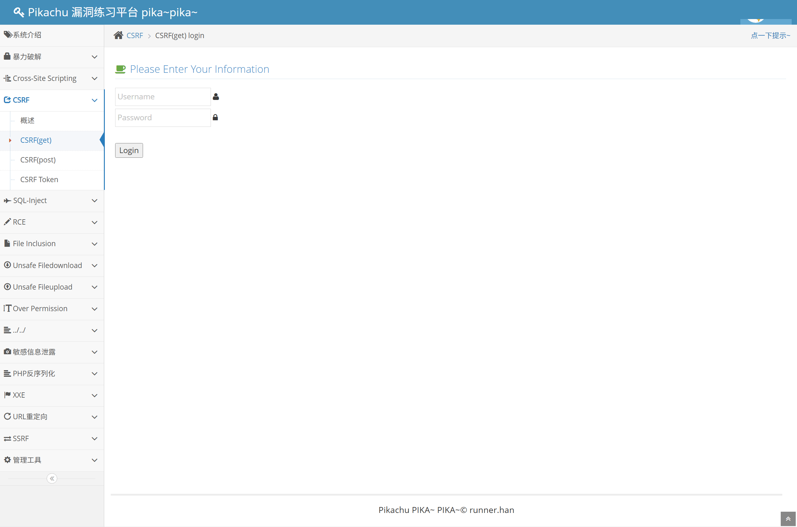
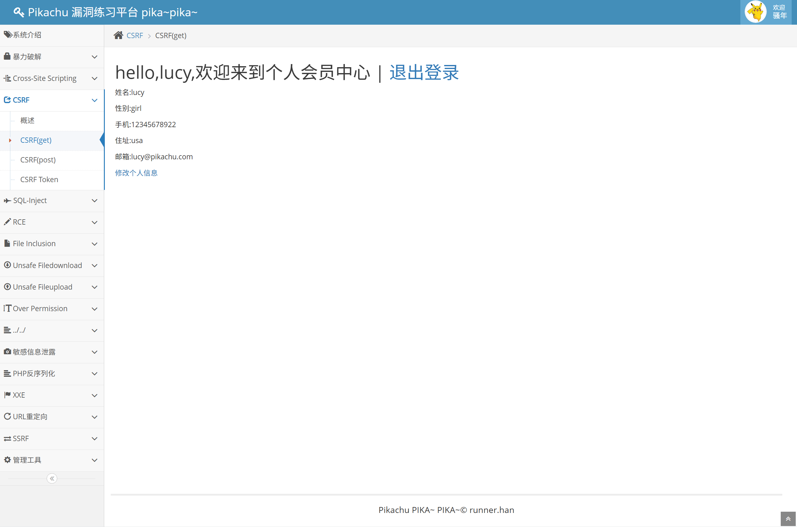
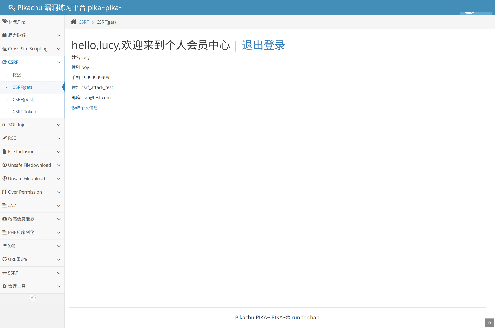
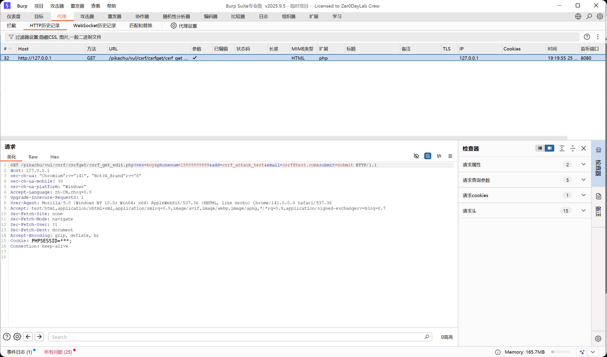
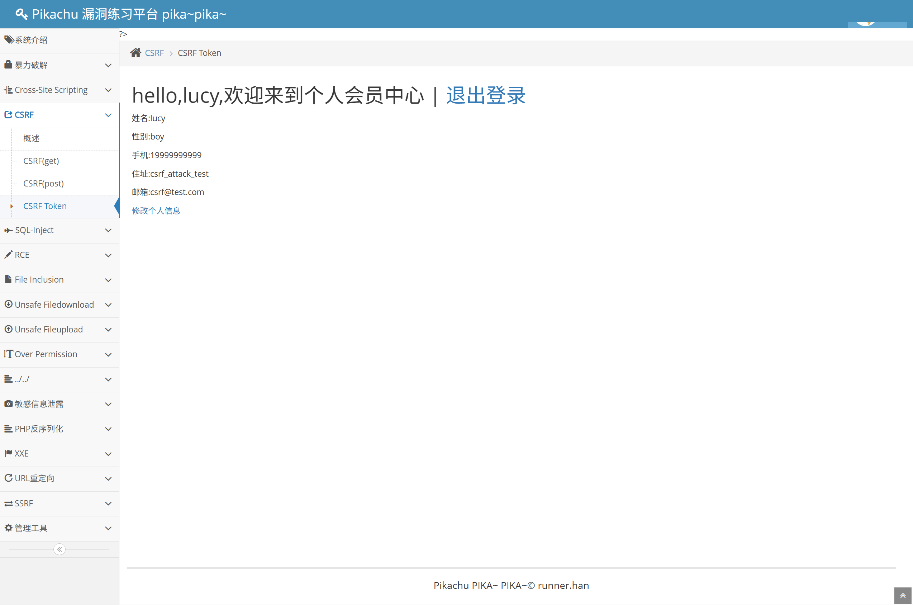

# Web 漏洞复现报告：CSRF 跨站请求伪造

## 1. 漏洞概述

* 漏洞名称：CSRF 跨站请求伪造

* 漏洞类型：身份认证与请求校验缺陷

* 风险等级：中危

* 复现环境：Pikachu

* 测试方式：本地授权靶场测试

* 影响范围：修改个人资料、修改密码、绑定邮箱、提交订单、转账、后台配置修改等依赖用户登录态的敏感操作。

本次测试在本地 Pikachu 靶场中完成，主要复现 CSRF(get) 模块。测试发现，用户登录后，修改个人资料的请求可以通过 GET 请求直接触发，且请求中没有 CSRF Token 等防护参数。

攻击者如果诱导已登录用户访问构造好的 URL，浏览器会自动携带该用户的 Cookie，从而导致服务端以该用户身份执行资料修改操作。

本次测试仅在本地授权靶场中进行，不涉及真实业务系统、公网目标或未授权测试。

## 2. 漏洞原理

CSRF 的全称是 Cross-Site Request Forgery，中文通常称为跨站请求伪造。

通俗理解：

```text

你已经登录了一个网站。

攻击者诱导你访问另一个页面或链接。

这个页面偷偷向已登录的网站发起请求。

浏览器会自动带上你的 Cookie。

网站以为这是你本人发起的请求，于是执行了操作。

```

CSRF 的核心不是攻击者知道用户密码，而是利用了两个条件：

1. 用户浏览器中已经存在登录态 Cookie；

2. 服务端没有校验这个请求是否来自用户真实意愿。

如果敏感操作只依赖 Cookie 判断用户身份，而没有 CSRF Token、Referer / Origin 校验、二次确认等机制，就可能出现 CSRF 风险。

## 3. 复现环境

* 系统环境：Windows

* Web 环境：小皮面板 / PHP / MySQL

* 靶场名称：Pikachu

* 靶场地址：`http://127.0.0.1/pikachu`

* 使用工具：Chrome、Burp Suite

* 漏洞模块：CSRF(get)

* 测试方式：本地授权靶场测试

## 4. 复现步骤

### 4.1 定位测试点

进入 Pikachu 后，选择左侧菜单：

```text

CSRF -> CSRF(get)

```

截图：



该页面提供登录入口，用于模拟用户登录后修改个人资料的业务场景。

### 4.2 登录普通用户

使用普通用户 `lucy` 登录后，进入个人会员中心。

截图：



页面中可以看到当前用户的姓名、性别、手机号、住址和邮箱等资料。

### 4.3 构造 CSRF 修改请求

在已登录状态下，构造一个用于修改个人资料的 GET 请求，将手机号、住址和邮箱修改为测试值，例如：

```text

phonenum=19999999999

add=csrf_attack_test

email=csrf@test.com

```

构造后的请求类似：

```text

http://127.0.0.1/pikachu/vul/csrf/csrfget/csrf_get_edit.php?sex=boy&phonenum=19999999999&add=csrf_attack_test&email=csrf@test.com&submit=submit

```

在真实攻击场景中，攻击者可能将该链接隐藏在图片、跳转链接或其他页面中，诱导已登录用户访问。

### 4.4 访问构造链接并观察结果

在当前用户仍保持登录状态的情况下，访问构造好的 GET 请求链接。

页面返回后，用户资料被修改为构造请求中的内容：

```text

手机：19999999999

住址：csrf_attack_test

邮箱：csrf@test.com

```

截图：



该结果说明，服务端仅根据浏览器自动携带的 Cookie 判断用户身份，并执行了资料修改操作。由于请求中没有有效的 CSRF Token 校验，CSRF 漏洞成功复现。

### 4.5 Burp Suite 抓包分析

使用 Burp Suite 抓取 CSRF 修改资料请求。

截图：



请求中的关键内容为：

```http

GET /pikachu/vul/csrf/csrfget/csrf_get_edit.php?sex=boy&phonenum=19999999999&add=csrf_attack_test&email=csrf@test.com&submit=submit HTTP/1.1

Cookie: PHPSESSID=***

```

从请求中可以看到：

1. 修改资料操作通过 GET 请求触发；

2. 请求参数直接包含要修改的资料内容；

3. 浏览器自动携带了 `PHPSESSID`；

4. 请求中没有 `csrf_token` 等随机校验参数。

这说明攻击者只要诱导已登录用户访问构造链接，就可能借助用户浏览器的登录态完成非预期操作。

### 4.6 Token 防护模块对比

进入 Pikachu 的 CSRF Token 模块进行对比。

截图：



CSRF Token 的防护思路是：服务端在页面中生成一个随机 Token，并在用户提交敏感操作时校验该 Token 是否有效。

如果攻击者无法获取用户页面中的 Token，就无法轻易伪造有效请求。这样可以降低 CSRF 攻击成功率。

## 5. 漏洞验证结果

CSRF 漏洞成功复现。

验证依据如下：

1. 用户 `lucy` 已经处于登录状态；

2. 修改资料操作可以通过 GET 请求触发；

3. 构造请求中包含 `phonenum`、`add`、`email` 等资料修改参数；

4. 浏览器自动携带了 `PHPSESSID`；

5. 请求中没有 CSRF Token 校验参数；

6. 访问构造请求后，用户资料被成功修改。

关键截图：

| 截图                                               | 说明                |
| ------------------------------------------------ | ----------------- |
| [01-csrf-page](../screenshots/csrf/01-csrf-page.png)           | CSRF(get) 测试页面    |
| [02-normal-profile-page](../screenshots/csrf/02-normal-profile-page.png) | 登录后用户资料页面         |
| [05-csrf-success-result](../screenshots/csrf/05-csrf-success-result.png) | 访问构造请求后资料被修改      |
| [06-burp-csrf-request](../screenshots/csrf/06-burp-csrf-request.png)   | Burp 抓取 CSRF 修改请求 |
| [07-token-compare](../screenshots/csrf/07-token-compare.png)       | CSRF Token 防护模块对比 |

## 6. 风险影响

CSRF 漏洞可能造成以下影响：

* 修改用户个人资料；

* 修改绑定邮箱或手机号；

* 修改密码或安全设置；

* 诱导用户提交订单、关注、点赞、删除数据等操作；

* 在管理员登录状态下，可能导致后台配置被修改；

* 与 XSS、越权等漏洞组合后扩大攻击影响。

在真实业务系统中，如果敏感操作缺少 CSRF 防护，攻击者可以通过诱导用户访问恶意页面，在用户不知情的情况下借用其登录态完成非预期操作。

## 7. 修复建议

建议从以下方面修复 CSRF 漏洞：

1. 对所有敏感操作增加 CSRF Token；

2. Token 应该随机、不可预测，并与用户会话绑定；

3. 服务端必须校验 Token，不能只在前端生成或校验；

4. 修改资料、修改密码、转账、删除等敏感操作不要使用 GET 请求；

5. 对敏感操作使用 POST 请求，并结合 Token 校验；

6. 校验 `Origin` 或 `Referer` 请求头，拦截异常来源请求；

7. 对 Cookie 设置 `SameSite=Lax` 或 `SameSite=Strict`；

8. 高风险操作增加二次确认、验证码或重新输入密码；

9. 避免仅依赖 Cookie 判断用户真实操作意愿；

10. 对异常来源的敏感操作请求记录日志并配置告警。

## 8. 安全运营视角：日志表现与告警建议

### 8.1 日志表现

CSRF 在日志中可能表现为：

* 敏感操作请求的来源页面异常；

* 请求带有合法 Cookie，但缺少 CSRF Token；

* 修改资料、修改密码、绑定邮箱等接口被外部页面触发；

* GET 请求中出现敏感操作参数；

* 同一用户短时间内出现异常资料变更；

* `Referer` 为空或来自非本站域名。

### 8.2 告警建议

* 对敏感操作接口缺少 Token 的请求进行告警；

* 对异常 `Origin`、异常 `Referer` 的敏感操作请求进行告警；

* 对 GET 请求触发修改类操作进行安全审计；

* 对短时间内频繁修改资料、邮箱、手机号等行为进行监控；

* 对管理员敏感操作增加更高等级告警。

### 8.3 误报控制

部分用户可能从浏览器收藏夹、空 Referer 环境或隐私浏览器访问页面，因此不能只依赖 Referer 是否为空判断 CSRF。更可靠的方式是结合 CSRF Token、请求来源、操作类型、用户身份和行为频率进行综合判断。

## 9. 复测结论

* 复测结果：未复测

* 复测说明：当前 Pikachu 靶场用于漏洞演示，未对源码进行实际修复。本报告根据漏洞原理给出修复建议。

* 整改建议：真实业务系统应对所有敏感操作增加服务端 CSRF Token 校验，并结合 SameSite Cookie、Origin / Referer 校验和二次确认机制降低 CSRF 风险。
