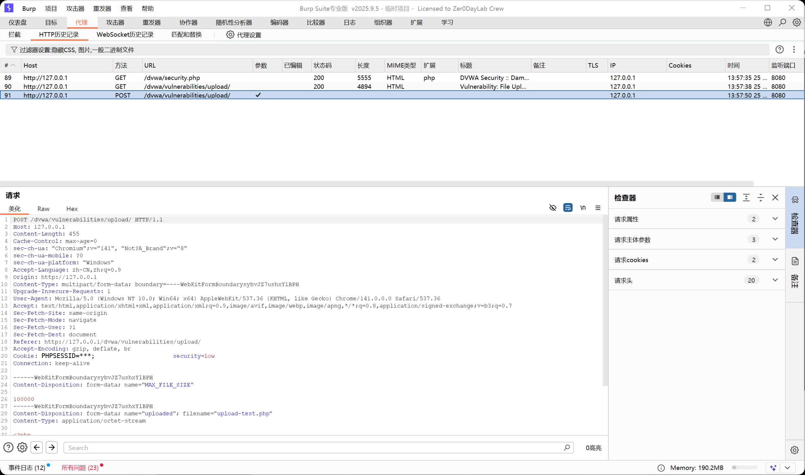
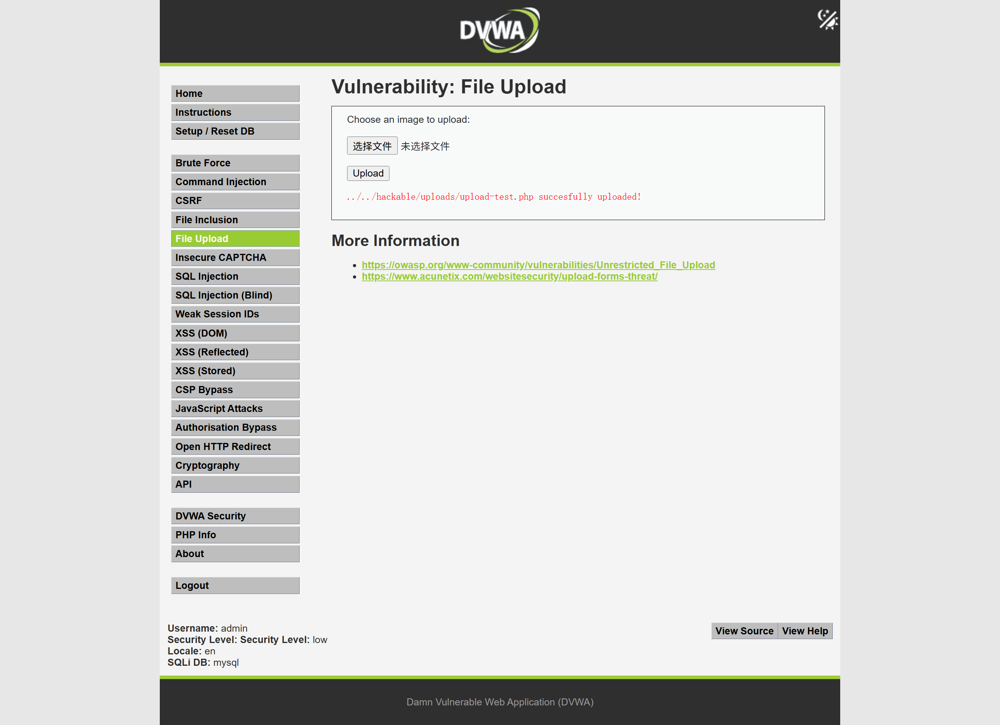

# 文件上传漏洞验证报告

## 1. 漏洞概述

本次测试针对文件上传功能进行安全验证，重点检查服务端是否对上传文件的后缀、MIME 类型、文件内容和存储路径进行有效限制。

测试发现，在低安全配置下，上传功能可能允许非预期类型文件上传，并且上传后的文件可通过 Web 路径访问，存在文件上传安全风险。

## 2. 测试环境

- 靶场环境：DVWA / 本地授权测试环境
- 测试账号：本地测试账号
- 测试工具：Burp Suite、浏览器、Linux 基础命令
- 测试时间：2026 年 6 月
- 测试范围：授权靶场中的 File Upload 模块

## 3. 测试位置

- 请求方法：POST
- 测试路径：`/dvwa/vulnerabilities/upload/`
- 测试参数：`uploaded`
- 是否需要登录：是
- Cookie 是否参与验证：是，需携带登录态 Cookie 和安全等级 Cookie
- 请求类型：`multipart/form-data`

示例请求位置：

```http
POST /dvwa/vulnerabilities/upload/ HTTP/1.1
Host: 127.0.0.1
Content-Type: multipart/form-data; boundary=----WebKitFormBoundary***
Cookie: PHPSESSID=***; security=low
```

## 4. 验证过程

### 4.1 Burp 抓包分析

进入文件上传页面后，先上传一张正常图片文件，并使用 Burp Suite 抓取上传请求。

抓包后关注以下字段：

- 文件上传字段名是否为 `uploaded`；
- 文件名是否由客户端可控；
- `Content-Type` 是否由客户端传入；
- 服务端是否返回上传后的文件路径；
- 上传目录是否可通过浏览器直接访问。

截图：



### 4.2 上传类型验证

在确认上传请求结构后，准备一个无害测试文件，用于验证服务端是否只允许上传图片类型。

测试文件示例：

```php
<?php
echo "file upload test success";
?>
```

该文件只输出固定文本，不包含 WebShell、命令执行、反弹连接或其他攻击行为。

通过 Burp Suite 观察上传请求，确认文件名、文件后缀和 MIME 类型均可能成为测试点。

重点观察：

```http
Content-Disposition: form-data; name="uploaded"; filename="upload-test.php"
Content-Type: application/octet-stream
```

如果服务端仅依赖前端限制或未校验后缀，可能导致 `.php` 等非预期文件被上传成功。

### 4.3 上传结果验证

提交测试文件后，观察页面响应。如果页面提示上传成功，并返回类似上传路径，说明服务端已接收该文件。

截图：




示例响应现象：

```text
../../hackable/uploads/upload-test.php successfully uploaded
```

随后访问上传后的文件路径，观察服务器是否解析执行该文件。如果页面返回固定文本 `file upload test success`，说明上传目录中的脚本文件可被 Web 访问并执行。

### 4.4 复测与对比

修复后再次上传相同测试文件，服务端应拒绝该文件，并返回明确的文件类型限制提示。

复测时重点检查：

1. `.php` 后缀是否被拒绝；
2. 修改 MIME 类型后是否仍被拒绝；
3. 伪造图片后缀是否仍会校验真实内容；
4. 上传目录是否禁止脚本执行；
5. 已上传的历史风险文件是否被清理。

## 5. 风险影响

文件上传漏洞可能导致攻击者上传非业务允许的文件类型。如果上传目录可被 Web 访问并且支持脚本解析，攻击者可能进一步执行恶意脚本，造成服务器被控制、敏感文件泄露、业务数据被篡改等严重后果。

在真实业务系统中，头像上传、附件上传、简历上传、工单附件、富文本图片上传等功能都需要重点关注该类风险。

## 6. 修复建议

- 使用服务端白名单限制文件后缀，只允许业务必需的类型；
- 校验文件真实内容，不只依赖客户端传入的 MIME 类型；
- 上传文件重命名，避免保留用户可控文件名；
- 将上传目录放在 Web 根目录之外，或禁止上传目录执行脚本；
- 限制单个文件大小和上传频率；
- 对上传文件进行安全扫描；
- 清理历史已上传的风险文件；
- 增加上传失败、异常后缀和高频上传行为的日志告警。

## 7. 复测结论

修复后重新上传相同测试文件，服务端已拒绝非白名单文件类型；修改 MIME 类型或伪造后缀后仍无法绕过；上传目录不再解析脚本文件。

复测结论：文件上传风险已完成修复，当前未发现可继续利用的上传路径。
