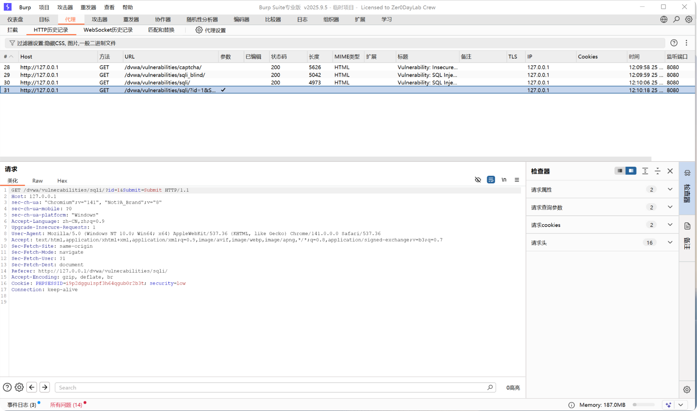
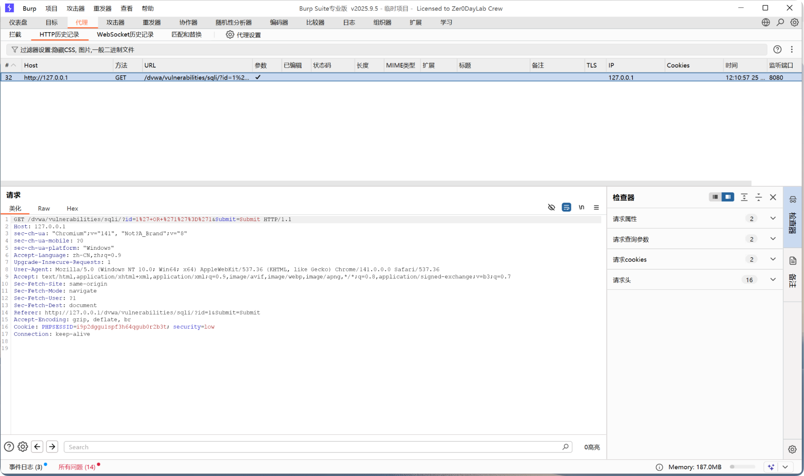
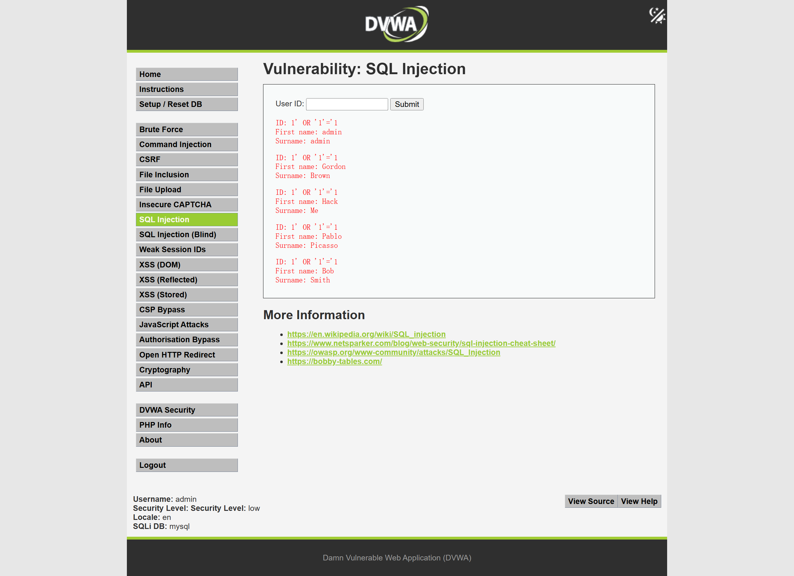
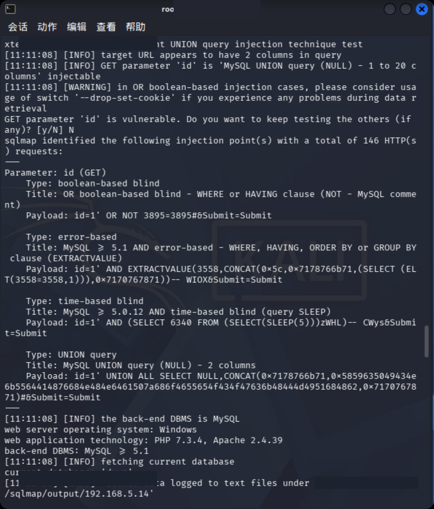

# SQL 注入漏洞验证报告

## 1. 漏洞概述

本次测试针对某业务查询参数进行 SQL 注入验证，通过 Burp Suite 抓包分析、手工构造 payload 和 SQLmap 工具辅助验证，判断该参数是否存在 SQL 注入风险。

测试重点不是单纯使用工具扫描，而是通过正常请求、异常输入、布尔条件对比和工具结果复核，形成完整的安全测试证据链。

## 2. 测试环境

- 靶场环境：DVWA / 本地授权测试环境
- 测试账号：本地测试账号
- 测试工具：Burp Suite、SQLmap、浏览器
- 测试时间：2026 年 6 月
- 测试范围：授权靶场中的 SQL Injection 模块

## 3. 测试位置

- 请求方法：GET
- 测试路径：`/dvwa/vulnerabilities/sqli/`
- 测试参数：`id`
- 是否需要登录：是
- Cookie 是否参与验证：是，需携带登录态 Cookie 和安全等级 Cookie

示例请求位置：

```http
GET /dvwa/vulnerabilities/sqli/?id=1&Submit=Submit HTTP/1.1
Host: 127.0.0.1
Cookie: PHPSESSID=***; security=low
```

## 4. 验证过程

### 4.1 Burp 抓包分析

登录靶场后进入 SQL Injection 测试页面，先输入正常参数 `id=1`，通过 Burp Suite 拦截并观察请求结构。

抓包后发现，用户输入会通过 URL 参数 `id` 提交到后端，服务端根据该参数返回对应用户信息。因此，`id` 参数属于本次测试的重点关注对象。

截图：





正常请求返回单个用户信息，说明该接口的业务逻辑是根据用户编号查询用户数据。

### 4.2 手工验证

在确认参数位置后，对 `id` 参数进行手工验证。测试时先使用异常字符观察响应，再使用布尔条件对比判断输入是否影响后端 SQL 查询逻辑。

测试 payload 示例：

```text
?id=1'
?id=1 and 1=1
?id=1 and 1=2
```

观察结果：

- 当输入单引号时，页面响应出现异常或返回内容变化；
- 当输入 `and 1=1` 时，页面返回结果与正常查询接近；
- 当输入 `and 1=2` 时，页面返回结果明显不同或为空。

根据响应差异，可以初步判断 `id` 参数可能存在 SQL 注入风险。该结论需要结合工具验证和人工复核继续确认。

### 4.3 工具辅助验证

在手工验证存在疑似注入点后，使用 SQLmap 对同一请求进行辅助验证。测试过程中保留登录态 Cookie，并指定待测参数，避免对非授权目标进行扫描。

示例验证思路：

```text
sqlmap -u "http://127.0.0.1/dvwa/vulnerabilities/sqli/?id=1&Submit=Submit" --cookie="PHPSESSID=***; security=low" -p id --batch
```

截图：





SQLmap 返回结果提示 `id` 参数存在注入风险后，需要人工复核工具结论，重点确认：

1. 工具测试的是否为当前授权靶场地址；
2. 注入参数是否与手工验证参数一致；
3. 响应差异是否能被人工复现；
4. 是否存在误报可能。

## 5. 风险影响

攻击者可能通过 SQL 注入漏洞读取数据库中的敏感信息，进一步造成数据泄露、账号风险或业务系统被攻击。

在真实业务系统中，SQL 注入可能影响用户信息查询、订单查询、登录认证、后台检索等功能。如果数据库账号权限配置过高，还可能导致数据篡改、数据删除或进一步扩大攻击面。

## 6. 修复建议

- 使用预编译语句或参数化查询，避免将用户输入直接拼接进 SQL 语句；
- 对输入参数进行白名单校验，例如用户编号只允许数字；
- 限制数据库账号权限，避免业务账号拥有高危权限；
- 关闭详细错误回显，避免暴露 SQL 语句、数据库类型和路径信息；
- 增加日志监控和异常请求告警，关注包含 SQL 关键字、异常符号和高频探测的请求。

## 7. 复测结论

修复后重新测试相同参数，原 payload 不再触发异常响应，布尔条件测试不再造成明显响应差异，SQLmap 未发现可利用注入点。

复测结论：该 SQL 注入风险已完成修复，当前未发现可继续利用的注入点。
